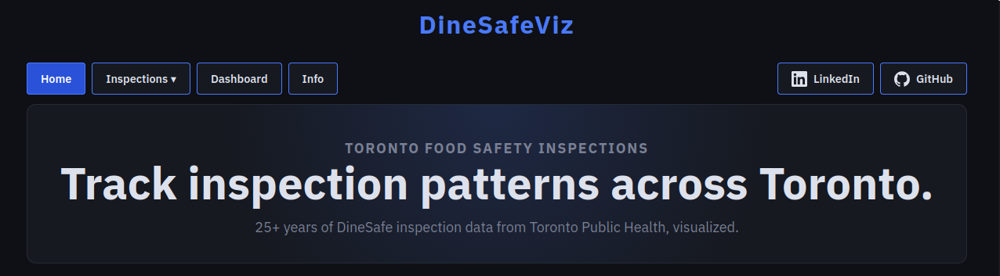
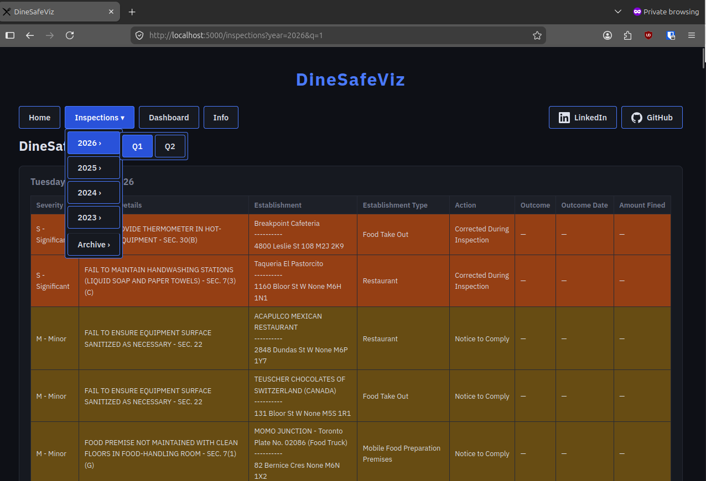
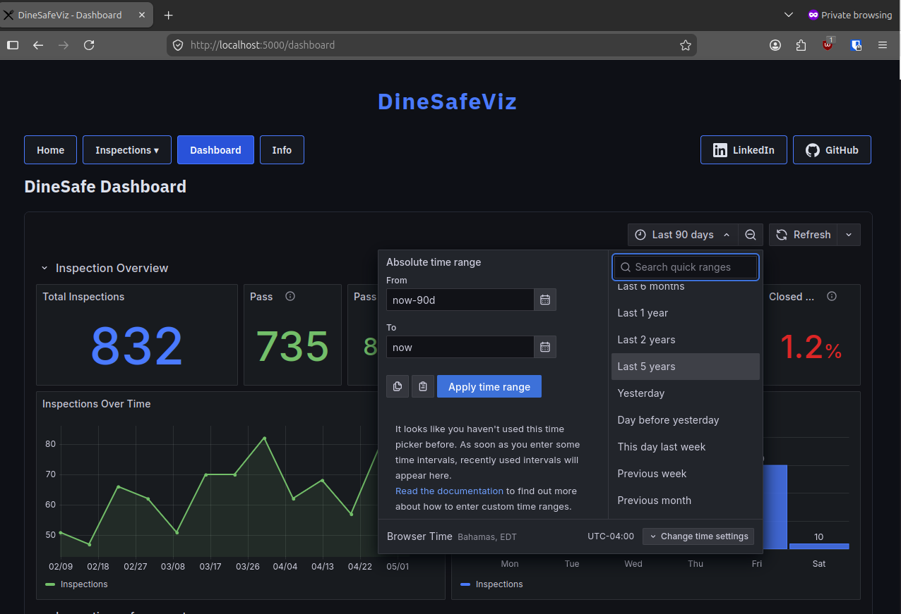
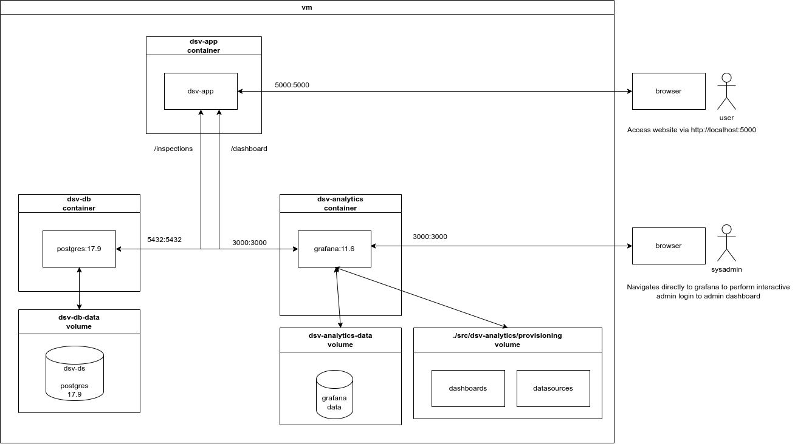

# DineSafeViz

Is a dockerized web app that vizualizes data from Toronto Public Health's food safety and inspection program, DineSafe.

# Tech Stack

[Well documented](docs/ref/arch.md) and built with a decent [devops](docs/ref/devops.md) toolchain

# Features

See a full list of Inspection results.

---

View a stats breakdown of the inspection results in the DSV Analytics
dashboard. Specify your own date range. Over 26 years of data!

# Architectual Overview

## Install Guide

[Instructions](docs/how-to/install-guide.md) for first time setup of the application

## Deployment Guide

Instructions to [deploy / redeploy](docs/how-to/deploy-guide.md) the application the app after a change
