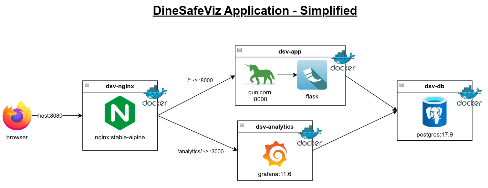

# DineSafeViz

DineSafeViz visualizes data from DineSafe, Toronto Public Health's food
safety and inspection program.

It's a self-hosted containerized web app that publishes and visualizes 26+ years
of inspection results.

## Features

### Inspection results

Browse the complete list of DineSafe inspection results.

### Analytics dashboard

View a stats breakdown of inspection results. Filter by any date range
across over 26 years of data.

### Self-hosted

Small footprint. Deploys to a self-hosted Ubuntu VM in a Proxmox environment.

### Infrastructure as code

Uses [infrastructure as code](docs/explanation/4-infrastructure-as-code.md) to automate VM
provisioning and app deployment.

## Architecture

The DineSafeViz application is a dockerized web app with a database backend. It
visualizes historic data and updates the dataset daily.

> [!NOTE]
> Data update feature: coming soon.

For details, see the
[architecture reference](docs/explanation/2-application-architecture.md) and the
[DevOps reference](docs/explanation/README.md).

### Application architecture

The DineSafeViz app has [three main services](docker-compose.yml), one edge
service, and two supporting services.

#### Main services

1. dsv-app: the Flask web app that serves inspection data and the metrics
   dashboard. It listens on internal port 8000.
2. dsv-db: a PostgreSQL database that stores the City of Toronto DineSafe
   dataset.
3. dsv-analytics: a Grafana-based metrics dashboard that visualizes DineSafe
   data.

#### Edge service

- dsv-nginx: the reverse proxy and entry point on host port 8080. It routes
  requests to `dsv-app` and proxies `/analytics/` to `dsv-analytics`.

#### Supporting services

These are one-off services for the initial setup of a fresh deployment in a VM.

1. dsv-init-db: seeds the database on first run, and refreshes recent data on
   later runs.
2. dsv-init-analytics: seeds the initial Grafana dashboard.

### [Infrastructure as code](docs/explanation/4-infrastructure-as-code.md)

Terraform, Packer, and Ansible are the infrastructure as code tools that
automatically:

- Provision an app VM.
- Maintain an app image.
- Deploy, tear down, and redeploy an application.

### [Information security](docs/explanation/6-security-architecture.md)

The app's Docker Compose configuration is retrieved from a `.env` file. Secrets
are stored in
[secrets.yml](infra/ansible/vault/secrets.yml) and are injected into the `.env`
file during deployment via IaC.

### [Monitoring](docs/explanation/9-monitoring-architecture.md) (coming soon)

Grafana dashboards monitor the VM health, web app metrics, and database
metrics.

## Getting started

- **[Install guide](docs/how-to/1-install/README.md):** instructions for
  installing the application and provisioning the infrastructure from scratch.
- **[Redeploy guide](docs/how-to/4-redeploy.md):** instructions to
  redeploy the app to existing infrastructure.

## Roadmap

See the [project roadmap](https://github.com/users/im-kenough/projects/11).

## Evolution

Watch how DineSafeViz evolved over time:

- v x.y.z: dockerized app on a self-hosted VM, orchestrated with IaC.
- v x.y.z: dockerized app on a local computer.
