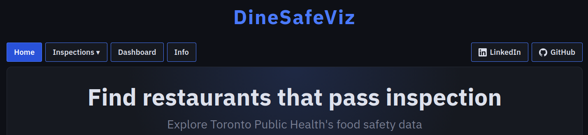
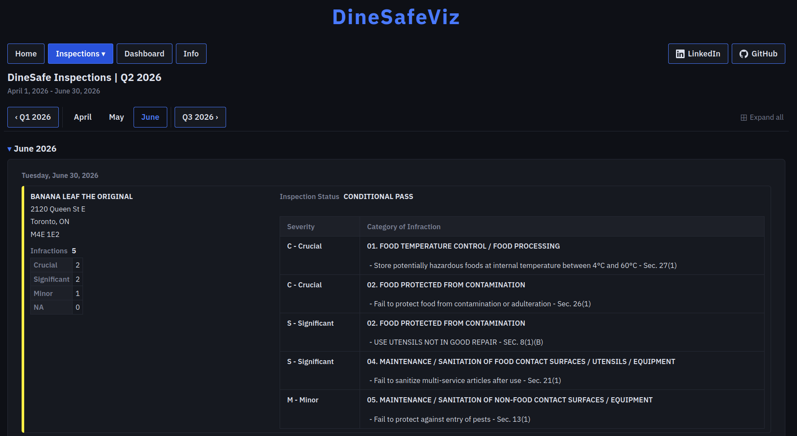
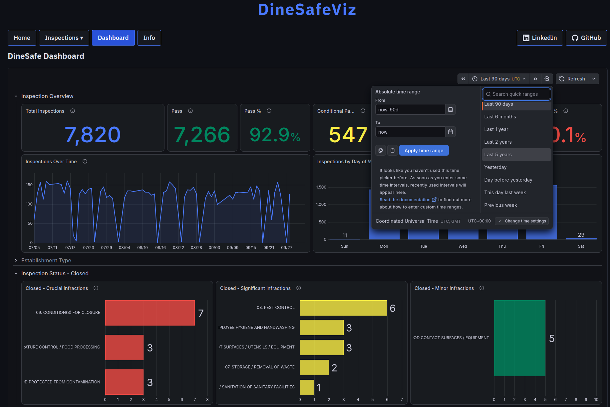

# DineSafeViz

## 1. Introduction
DineSafeViz is a containerized web app that builds inspection reports and
interactive analytics from Toronto Public Health's food safety data.

The app retrieves and parses the DineSafe dataset (Toronto Public Health's food
safety program) from the City of Toronto's Open Data Portal.

## 2. Features

### 2.1 Inspection results

Check when an establishment was inspected and whether there were any health
code violations.

### 2.2 Analytics dashboard

Explore and get a statistical breakdown of **over 26 years** of inspection data.

## 3. Technology stack

| Layer          | Technology                               |
| -------------- | ---------------------------------------- |
| Web app        | Python, Flask, Gunicorn                  |
| Database       | PostgreSQL                               |
| Analytics      | Grafana                                  |
| Reverse proxy  | nginx                                    |
| Containers     | Docker, Docker Compose                   |
