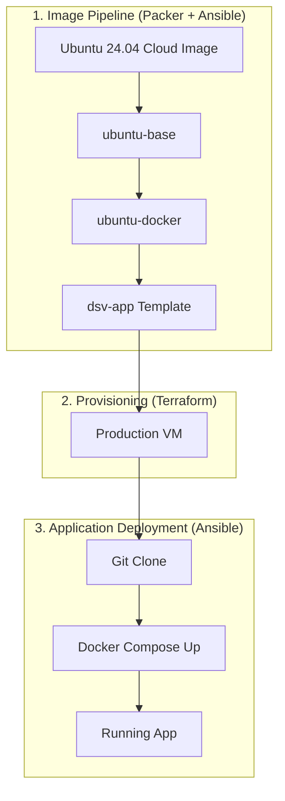
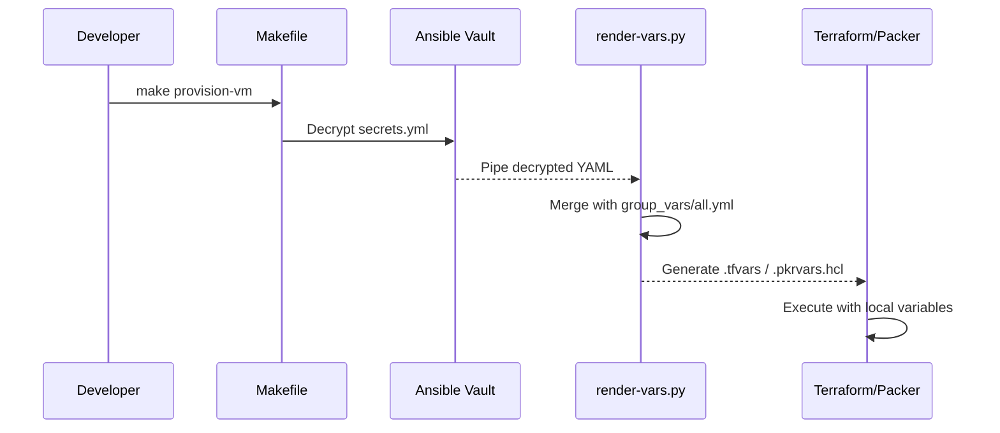

# Infrastructure as Code Architecture

This document describes the Infrastructure as Code (IaC) strategy for
DineSafeViz. It explains how infrastructure is provisioned, configured, and
deployed using a layered approach.

## Goals

1. **Reproducible infrastructure** — `make up` goes from nothing to a running
   application.
2. **Layered golden images** — enterprise-standard bake-time pipeline using
   Packer and Ansible.
3. **Secrets hygiene** — no unencrypted secrets in git; single source of truth
   in Ansible Vault.
4. **Single Source of Truth (SSOT)** — centralized configuration in Ansible
   `group_vars/all.yml`.

## Architecture Overview

DineSafeViz uses a three-stage pipeline to move from a raw OS image to a
fully operational application environment.

## Workflow and Toolchain

| Component | Tool | Responsibility |
| :--- | :--- | :--- |
| **Image Building** | Packer | Automates the creation of Proxmox VM templates. |
| **Configuration** | Ansible | Provisions software and security settings within images. |
| **Provisioning** | Terraform | Declares and manages the lifecycle of the final VM. |
| **Secrets** | Ansible Vault | Encrypts sensitive data at rest in the repository. |
| **Orchestration** | Makefile | Provides a unified CLI for all infrastructure tasks. |

## Variable and Secret Management

The project implements a strict Single Source of Truth (SSOT) pattern.
Configuration is centralized in two locations within the `infra/ansible/`
directory.

### Variable Storage

- **Non-sensitive variables**: Stored in `infra/ansible/group_vars/all.yml`. This
  includes VM specifications (CPU, RAM), network settings, and image IDs.
- **Secrets**: Stored in `infra/ansible/vault/secrets.yml`. This file is
  encrypted with Ansible Vault and contains API tokens, private keys, and
  passwords.

### Variable Bridging

Because Terraform and Packer cannot natively read Ansible Vault files, a Python
bridge script (`infra/scripts/render-vars.py`) merges these sources into the
required formats at runtime.

## Image Pipeline Layers

Each layer in the pipeline adds a specific concern, allowing for efficient
updates and reuse.

### Layer 1: ubuntu-base
Minimal hardened Ubuntu 24.04 server.

- **Security**: UFW firewall, fail2ban, disabled root/password auth.
- **Common Packages**: `curl`, `git`, `jq`, `htop`, `unattended-upgrades`.
- **System**: NTP, Timezone (America/Toronto), DNS configuration.

### Layer 2: ubuntu-docker
Docker-ready VM base for containerized workloads.

- Official Docker CE repository setup.
- Log rotation and daemon optimizations.
- Firewall rules for Docker services.

### Layer 3: dsv-app
Application-specific identity and credentials.

- Hostname and static IP assignment.
- GitHub App private keys for repository access.
- Application directory structure.

## Operations

All infrastructure operations are managed through the `infra/` directory.

| Command | Description |
| :--- | :--- |
| `make bake-all` | Rebuilds all three image layers from scratch. |
| `make provision-vm` | Provisions the VM using Terraform. |
| `make deploy-app` | Deploys the application using Ansible. |
| `make up` | Full end-to-end: provision VM and deploy app. |
| `make down` | Full teardown: destroy app and VM. |

## Next Steps

- Review the [Secrets Management](secrets-mgt.md) guide for details on Vault
  usage.
- See the [Operations Guide](../../ops/index.md) for troubleshooting and
  maintenance procedures.
