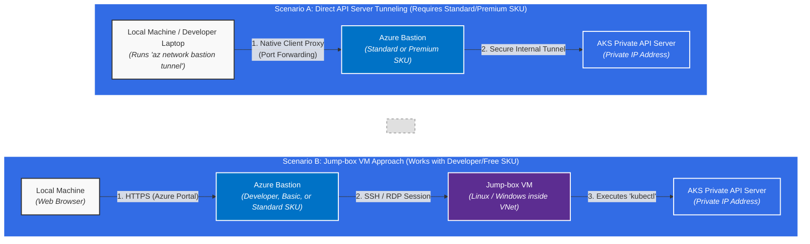

# Azure Bastion Scenarios for AKS `kubectl` Access

This document details the two primary methods for securely executing `kubectl` commands against a private Azure Kubernetes Service (AKS) cluster using Azure Bastion.

### Scenario Breakdown

#### Scenario A: Direct API Server Tunneling
*   **Best for:** Developers who want a seamless, native local terminal experience when running `kubectl` commands.
*   **How it works:** The Azure CLI's Native Client feature connects to Azure Bastion, which sets up a proxy tunnel directly linking your local `localhost` port to the private IP of the AKS API Server.
*   **Requirements:** You *must* use the paid **Standard or Premium SKU** of Azure Bastion, as the Developer (free) and Basic tiers do not support the Native Client feature.

#### Scenario B: Jump-box VM Approach
*   **Best for:** Cost-optimized environments (like a homelab), tightly controlled enterprise environments, or when client laptops are untrusted.
*   **How it works:** You log into the Azure Portal via your web browser, use Bastion to start a secure SSH or RDP session into a Jump-box VM residing inside your virtual network, and execute `kubectl` commands directly from that VM.
*   **Requirements:** This scenario is compatible with the free **Developer SKU**, as well as all other paid tiers. It requires maintaining a separate Jump-box Virtual Machine.
