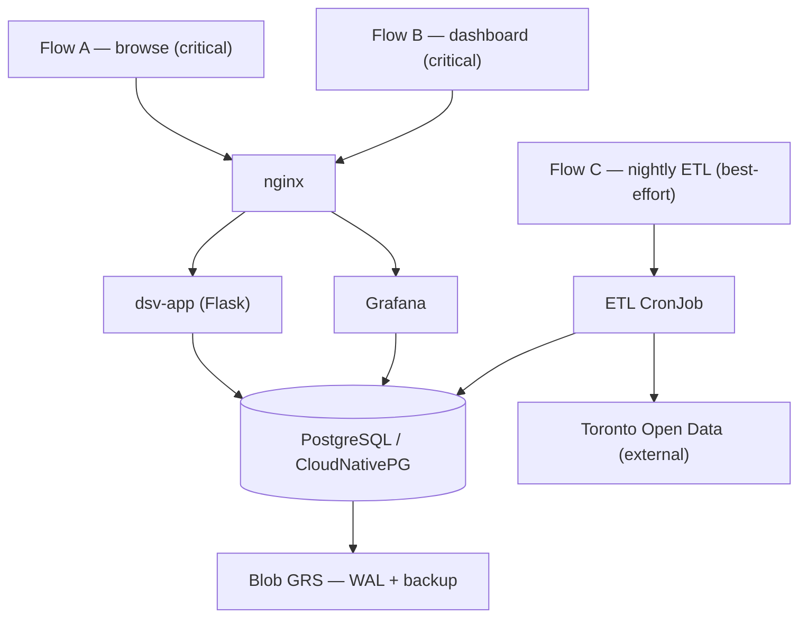

# 5-2-3. Design guide — Health modeling

> Source: [Health modeling for workloads](https://learn.microsoft.com/en-us/azure/well-architected/design-guides/health-modeling)
>
> Parent: [5-2 Design guides](5-2-0-warch-design-guides.md) · Status: **tracked open work** (answers open [RE:04](2-warch-checklist.md) / RE:10)

Health modeling is a **logical design exercise** that combines business context with monitoring data to classify each part of the workload as **Healthy / Degraded / Unhealthy**, so alerts fire on *business impact* rather than on every raw metric. It's tool-agnostic: the model is defined from the [decision register](../../../ref/spec.md) and wired into the workload's Log Analytics backend (see [Decisions](#decisions)).

This document is the source of truth for the health model. Its design and parameters are settled below; the remaining [tracked open work](5-2-0-warch-design-guides.md) is implementation — building the alert rules and workbook.

## Scope

Given the workload's size (~10 concurrent connections, ~100k rows, three flows), the model is kept at **flow level plus the shared database entity** rather than modeling every pod. That's enough to make alerts meaningful without the engineering overhead the guide warns about.

## Entities and relationships

The health entities are the three [critical flows](../../../ref/spec.md#critical-user-flows) and the components they depend on. Relationships mirror the runtime dependency chains.

| Entity | Type | Depends on | Criticality |
| --- | --- | --- | --- |
| **Flow A** — browse inspection data (Flask pages) | User flow | nginx → dsv-app → PostgreSQL | **Critical** |
| **Flow B** — embedded Grafana dashboard | User flow | nginx → Grafana → PostgreSQL | **Critical** |
| **Flow C** — nightly ETL refresh | System flow | ETL CronJob → Toronto Open Data → PostgreSQL | **Best-effort** |
| **nginx ingress** | Infra component | — | shared by A, B |
| **dsv-app** (Flask/gunicorn) | App component | PostgreSQL | A |
| **Grafana** (dsv-analytics) | App component | PostgreSQL | B |
| **PostgreSQL** (CloudNativePG) | Infra component | Blob GRS (WAL/backup) | **shared by A, B, C** |
| **ETL CronJob** | Job component | Toronto Open Data (external) | C |

**Propagation rule:** PostgreSQL is the shared dependency, so if the database is **Unhealthy**, flows A and B are Unhealthy regardless of their own components. This dependency chain is the whole point — one database alert explains a site-wide outage instead of a storm of per-component alerts.

## Business context

From the [spec](../../../ref/spec.md): flows A and B are **critical** with a defined degraded fallback — a **holding page via manual DNS flip**; flow C is **best-effort** (a missed refresh is acceptable). This directly sets escalation priority: A/B health changes are actionable; flow C changes are informational. Because there is a single operator, the "escalation path" is one notification channel — a **Discord/Slack webhook** (free, and demonstrable in a portfolio).

## Reliability metrics (SLIs / SLOs)

The [performance](../../../ref/spec.md#performance-targets) and [recovery](../../../ref/spec.md#recovery-targets) targets become the SLIs that drive state definitions:

| SLI | Target (SLO) | Source | How it's measured (Log Analytics backend) |
| --- | --- | --- | --- |
| Page/dashboard latency (flows A/B) | p95 **< 1s** Healthy · **1–3s** Degraded · **> 3s** Unhealthy | spec PE:01 | KQL over **nginx ingress / app request logs** (Container Insights) |
| Flow availability (A/B) | **`/readyz`** succeeding while cluster is running; ingress 5xx **> 5%** = secondary Degraded | flow criticality | KQL on `/readyz` status + ingress 5xx rate |
| Data freshness (flow C) | last ETL success **≤ 24h** (RPO ≤ 24h) | spec RPO | **Grafana alert** on a `max(loaded_at)` query against the existing Postgres datasource |
| Backup/WAL health | continuous archiving succeeding | CloudNativePG | CNPG operator/instance logs in Container Insights (`ContinuousArchiving` failures) |

**Evaluation window:** a **5-minute rolling window**, re-evaluated every 5 minutes — enough to smooth single-request noise while detecting well inside the tier-1 RTO (~20–30 min). Availability comes from the `/readyz` **synthetic probe** rather than organic request error-rate, because near-zero visitor traffic makes percentage-based error rates statistically meaningless (a couple of failures against a tiny denominator reads as a huge error rate).

## Health signals available today

The guide's "use health probes" technique is already partly implemented; the metrics/log techniques are not yet wired up.

| Signal | Source | What it tells us | Status |
| --- | --- | --- | --- |
| `GET /healthz` → `200 ok` | dsv-app | Process is alive (liveness) | **Exists** (`app.py`) |
| `GET /readyz` → `200` / `503` | dsv-app | App **and** its DB dependency are reachable (`SELECT 1`, 1s timeout) | **Exists** (`app.py`) |
| `pg_isready` | PostgreSQL | Database accepting connections | **Exists** (compose healthcheck; K8s probe in AKS) |
| `GET /api/health` (`"database":"ok"`) | Grafana | Grafana up and its datasource reachable | **Exists** (used by init job) |
| Cluster `status.conditions` (`Ready`, `ContinuousArchiving`, `LastBackupSucceeded`) | CloudNativePG | DB readiness **and** backup/WAL health — ties directly to RPO | **Available**, not yet consumed |
| `cnpg_*` Prometheus metrics | CloudNativePG exporter | Connections, replication, query stats | **Available**, but needs a Prometheus scraper — **out of scope** given the Log Analytics-only decision |
| Container/pod logs & metrics | Container Insights → Log Analytics (30-day) | Pod restarts, CPU/mem, request/operator logs | **Exists** in AKS |

**Chosen approach:** **Log Analytics only** — no Prometheus/Alertmanager. SLIs are computed with **KQL over Container Insights logs** (ingress request latency/5xx, `/readyz` status, CNPG operator archiving errors), and the flow-C data-freshness signal reuses the **existing Grafana** Postgres datasource. This adds no new infrastructure and no RAM overhead on the B2s/Spot nodes. The trade-off is coarser signals than a metrics pipeline would give — acceptable at this scale, and revisitable if the workload grows.

## Health-state definitions

### Flow A — browse (nginx → app → db)
- **Healthy:** `/readyz` 200, ingress 5xx rate ≈ 0, p95 page latency < 1s.
- **Degraded:** p95 latency 1–3s, **or** intermittent 5xx below ~5%, **or** DB connections near the ~10 ceiling.
- **Unhealthy:** `/readyz` 503 (DB unreachable), **or** sustained 5xx, **or** app pods not `Ready` → holding-page fallback.

### Flow B — dashboard (nginx → Grafana → db)
- **Healthy:** Grafana `/api/health` `database: ok`, dashboard panels render < 1s.
- **Degraded:** slow panel queries 1–3s, or some panels error while others render.
- **Unhealthy:** Grafana down or datasource unreachable → holding-page fallback.

### Flow C — nightly ETL (CronJob → external → db)
- **Healthy:** last run succeeded and `max(loaded_at)` within 24h.
- **Degraded:** run was late or retried but completed within the 24h window.
- **Unhealthy:** > 24h since last success (RPO at risk). Best-effort, so this is **informational, not paging**.

### PostgreSQL (shared entity)
- **Healthy:** `Ready=True`, `ContinuousArchiving=True`, `LastBackupSucceeded=True`, connections < ~10, query p95 < 1s.
- **Degraded:** archiving lagging, connections near ceiling, or elevated latency.
- **Unhealthy:** `Ready=False` or unreachable → propagates to flows A and B.

### A fourth state: Offline (expected)

The guide stresses that a health model *"should clearly distinguish between expected or transient but recoverable failures and a true disaster state."* Because clusters are **stopped by default** ([spec](../../../ref/spec.md)), "everything down" is usually the **normal** state, not an incident. The model therefore includes an explicit **Offline (expected)** state so a deliberately stopped cluster never pages as Unhealthy — health is only evaluated during running/demo windows. The running-window signal is **node presence via the Log Analytics `Heartbeat` table**: recent heartbeats mean the cluster is running and health is evaluated; no heartbeats mean it's Offline and alert evaluation is suppressed. This is automatic — no manual "demo on" flag to remember — and fits the on-demand usage pattern, since demos can't be pre-scheduled.

## Alerting and visualization

- **Alerting:** one alert per **flow health state**, not per raw metric — the guide's core noise-reduction principle. Critical flows (A/B) page; flow C notifies. Two rule sources feed one channel:
  - **Log Analytics scheduled-query alert rules** for the infra signals (ingress latency/5xx, `/readyz`, CNPG archiving errors) → an **action group** with a **webhook** receiver.
  - **Grafana alert rule** for the flow-C data-freshness query (`max(loaded_at)`) on the existing Postgres datasource → a Grafana **contact point** on the same webhook.
- **Delivery:** a **Discord/Slack webhook** — free, and both Azure Monitor action groups and Grafana contact points support webhook delivery natively, so no new infrastructure is needed.
- **Visualization:** a **traffic-light** view (green/amber/red) across the dependency chain, rendered in a **Log Analytics workbook**, with accessibility considered (don't rely on colour alone). The workbook keeps operator health behind Azure RBAC and off the visitor-facing (anonymous) Grafana. *Backlogged:* optionally surface the same health in the existing Grafana via a free **Azure Monitor datasource** for a single pane of glass — deferred because it needs **careful Azure auth setup** (a managed identity or service principal with Log Analytics Reader on the workspace) plus Grafana folder permissions so anonymous viewers can't see operator health.

The managed **Azure Monitor health models** feature is intentionally **not** adopted — it's a paid layer that duplicates what free/OSS tooling can do here, against the project's cost-first preference.

## Maintenance

Per the guide: treat the health model as a versioned workload artifact (this file is the source of truth), evolve it when components change, and keep health data within the existing **30-day** retention. No long-term archival is needed for a portfolio workload.

## Decisions

| # | Decision | Outcome |
| --- | --- | --- |
| 1 | **Observability tooling** | **Log Analytics only** — KQL over Container Insights logs for infra signals; existing Grafana Postgres datasource for flow-C freshness. No Prometheus/Alertmanager, no new infra. |
| 2 | **SLO thresholds & window** | Latency p95 **< 1s / 1–3s / > 3s**; availability from the **`/readyz`** probe (ingress 5xx > 5% secondary); **5-minute** rolling window. |
| 3 | **Offline detection** | **Offline (expected)** state, gated on **Log Analytics `Heartbeat`** presence. |
| 4 | **Model scope** | **Flow-level + shared DB entity** (not full per-component). |
| 5 | **Alert delivery** | **Discord/Slack webhook** — Log Analytics action group + Grafana contact point. |
| 6 | **Visualization surface** | **Log Analytics workbook** now; Grafana + Azure Monitor datasource **backlogged** (needs careful Azure auth setup). |

With the model and its parameters settled, the remaining work is implementation — the KQL alert rules, the Grafana freshness alert, the webhook wiring, and the workbook. Tracked against RE:04 / RE:10.
