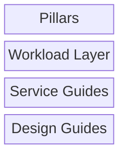
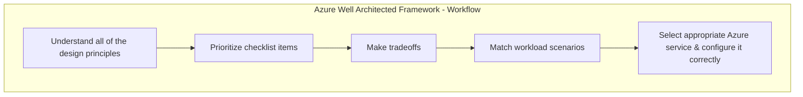

# AKS Planning

DineSafeViz was designed using the [Azure Well-Architected Framework](https://learn.microsoft.com/en-us/azure/well-architected/what-is-well-architected-framework?source=recommendations), Microsoft's best practices. This project applies relevant topics and adapts guidance to suit my scope and use case.

## Workflow

The [process](https://learn.microsoft.com/en-us/azure/well-architected/what-is-well-architected-framework?source=recommendations#suggested-learning-process) for working through the Azure Well-Architected Framework.

Throughout the process, consider what [maturity model](https://learn.microsoft.com/en-us/azure/well-architected/what-is-well-architected-framework?source=recommendations#adopt-a-maturity-model) is applicable for your implementation

### 1. Understand all the design principles

Design principles were reviewed in docs/explanation/aks/planning/1-warch-design-principles.md

### 2. Prioritize checklist items

Select checklist items in docs/explanation/aks/planning/2-warch-checklist.md

### 3. Make trade offs

Tradeoffs are considered in docs/explanation/aks/planning/3-warch-tradeoffs.md

### 4. Match workload scenarios

Workloads are considered in docs/explanation/aks/planning/4-warch-workloads.md

### 5. Select Azure service

Azure services are considered in docs/explanation/aks/planning/5-1-warch-service-guides.md

Azure designs are considered in docs/explanation/aks/planning/5-2-warch-design-guides.md

