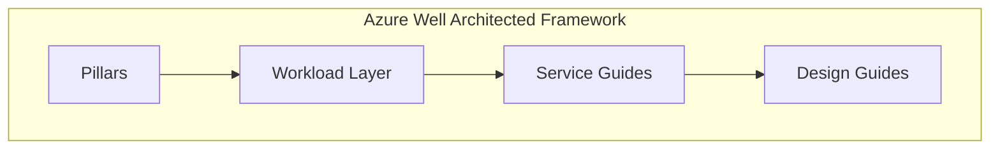

# AKS Planning

DineSafeViz was designed using the Microsoft's [Azure Well-Architected Framework](https://learn.microsoft.com/en-us/azure/well-architected/what-is-well-architected-framework?source=recommendations), a set of Azure best practices. This project selects relevant topics and adapt guidance to suit my scope and use case.

## Pillars

## Workloads

## Service guides

## Design guides

