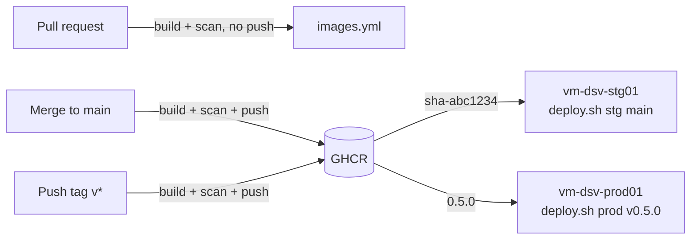

# CI and CD for the Azure VM deployment

This document explains how a code change becomes a running container on the
stg or prod VM. It covers the workflows, how images are tagged, how
dependencies and vulnerabilities are tracked, and worked examples of the
common tasks.

<!-- prettier-ignore -->
> [!NOTE]
> This describes the target state for the Azure VM deployment. It isn't built
> yet. In Phase 1, deploys are manual over SSH. Phase 2 runs the same
> `deploy.sh` from GitHub Actions.

## Pipeline at a glance

CI builds, scans, and publishes images. CD pulls a specific image tag onto a
VM. The two meet at GHCR.



The rule is simple: `main` goes to stg, and `v*` tags go to prod. The same rule
appears in the image tags, in `deploy.sh`, and in the Phase 2 GitHub
Environment protections described in
[Identity and access management](../../ref/iam.md).

## Workflows

The repository has these automation pieces:

| File                                  | Trigger                       | What it does                                                    |
| ------------------------------------- | ----------------------------- | --------------------------------------------------------------- |
| `.github/workflows/images.yml`        | PR, push to `main`, `v*` tag, weekly | Builds, scans, and (except on PRs) pushes the owned images |
| `.github/workflows/release.yml`       | `v*` tag                      | Publishes the matching draft release                            |
| `.github/workflows/release-drafter.yml` | Push to `main`, PR          | Keeps the draft release notes up to date                        |
| `.github/dependabot.yml`              | Weekly schedule               | Opens PRs for outdated dependencies                             |

`images.yml` builds two images. Upstream images (nginx, Postgres, Grafana,
curl, and cloudflared) are pulled by pinned tag and aren't rebuilt.

| Image                            | Source        |
| -------------------------------- | ------------- |
| `ghcr.io/im-kenough/dsv-app`     | `src/dsv-app` |
| `ghcr.io/im-kenough/dsv-init-db` | `src/dsv-db`  |

## Image tags

Every deployable tag is immutable, so the code on the VM and the image it runs
always match, and rolling back means deploying an older tag.

| Trigger        | Tags pushed           | Deployed with              |
| -------------- | --------------------- | -------------------------- |
| Pull request   | None (build only)     | Not deployed               |
| Push to `main` | `main`, `sha-abc1234` | `deploy.sh stg main`       |
| Tag `v0.5.0`   | `0.5.0`, `0.5`        | `deploy.sh prod v0.5.0`    |

There's no `latest` tag. `deploy.sh stg main` resolves `main` to its commit
and pulls the matching `sha-` tag, never the moving `main` tag.

## Dependency updates and vulnerability scanning

Three free tools keep dependencies current and flag known vulnerabilities.

- **Dependabot version updates** open weekly PRs for each ecosystem:

  | Ecosystem        | Location                       | Updates                                  |
  | ---------------- | ------------------------------ | ---------------------------------------- |
  | `github-actions` | `.github/workflows`            | Action SHA pins and their version comments |
  | `docker`         | `src/dsv-app`, `src/dsv-db`    | Dockerfile base images                   |
  | `docker-compose` | Repository root                | nginx, Postgres, Grafana, curl, cloudflared tags |
  | `pip`            | `src/dsv-app`, `src/dsv-db`    | `requirements.txt` packages              |

  Minor and patch updates are grouped into one PR per ecosystem. Major
  Postgres updates are ignored, because moving from 17 to 18 needs a data
  migration, not just a new tag. GitHub doesn't document whether the
  `docker-compose` ecosystem reads override files, so watch for a
  cloudflared PR. If none arrives, the weekly rescan still flags
  vulnerabilities in the pinned cloudflared tag, and you update it by hand.

- **Dependabot alerts and security updates** are turned on in the repository
  settings. They open PRs when a dependency has a published advisory, without
  waiting for the weekly schedule.

- **Trivy image scanning** runs in `images.yml`. Each owned image is built
  locally, scanned, and only pushed if the scan passes. On pushes, results go
  to the repository's **Security > Code scanning** page as SARIF; on pull
  requests, the scan prints a table in the job log. A weekly scheduled
  run rescans the deployed tags and the pinned upstream images, because new
  vulnerabilities are published after an image is built.

  | Setting          | Value                                       |
  | ---------------- | ------------------------------------------- |
  | Blocks the push  | `CRITICAL` vulnerabilities that have a fix  |
  | Reported only    | `HIGH` and below, and anything without a fix |

Code scanning and Dependabot are free for public repositories. All actions are
pinned to full commit SHAs, and Dependabot keeps those pins current.

## Examples

The following examples show the common tasks end to end. In Phase 1, the
deploy commands run over SSH on the VM.

### Open a pull request

When you open a PR, `images.yml` builds both images and scans them, but
doesn't push anything. A red check means a Dockerfile no longer builds or an
image has a fixable critical vulnerability.

```bash
git switch -c fix-map-legend
git commit -am "fix(app): correct map legend colors"
git push -u origin fix-map-legend
gh pr create --fill
```

### Deploy to stg

After the PR merges, `images.yml` pushes `sha-<commit>` for the new `main`.
When the workflow is green, deploy that commit to stg:

```bash
gh run watch                       # wait for images.yml on main
ssh dsv-stg                        # vm-dsv-stg01
cd ~/DineSafeViz && ./scripts/deploy.sh stg main
```

`deploy.sh` fails before changing anything if the matching `sha-` image
doesn't exist yet.

### Release to prod

A release is a `v*` tag on a commit that's already been checked on stg.
Pushing the tag publishes the draft release and builds the `0.5.0` images.

```bash
git switch main && git pull
git tag v0.5.0 && git push origin v0.5.0
gh run watch                       # wait for images.yml on v0.5.0
```

Then, from your workstation as `dsv-ops01`, take a pre-deploy snapshot of the
prod OS disk. Snapshots go in `rg-dsv-prod01-snapshots`, which has no lock,
because the lock on `rg-dsv-prod01` would stop you deleting old ones. Set
`SUB_ID` to the ID of subscription `sub-dsv-prod01` first:

```bash
DISK=$(az vm show -g rg-dsv-prod01 -n vm-dsv-prod01 \
  --subscription "$SUB_ID" --query storageProfile.osDisk.managedDisk.id -o tsv)
az snapshot create -g rg-dsv-prod01-snapshots --subscription "$SUB_ID" \
  -n "snap-dsv-prod01-v0.5.0-$(date +%Y%m%d)" --source "$DISK" --incremental true
```

Keep the newest three snapshots and delete the rest. Then deploy:

```bash
ssh dsv-prod                       # vm-dsv-prod01
cd ~/DineSafeViz && ./scripts/deploy.sh prod v0.5.0
```

### Roll back prod

If a release misbehaves, deploy the previous tag. The images and the Git tag
both still exist, so this is the same command with an older version:

```bash
ssh dsv-prod
cd ~/DineSafeViz && ./scripts/deploy.sh prod v0.4.0
```

If the VM itself is damaged, restore the pre-deploy snapshot instead.

### Handle a Dependabot PR

Treat a Dependabot PR like any other PR: let `images.yml` build and scan it,
check the release notes for breaking changes, then merge and deploy to stg.
For Grafana and nginx updates, check `/analytics/` and the map on stg before
the next release. A Grafana update also changes the bundled PostgreSQL plugin.
Before you merge one, confirm that the new image still bundles it, as
described in
[Grafana: the bundled PostgreSQL plugin](../grafana-postgres-plugin.md#how-the-plugin-gets-updated).

### Fix a failed scan

When Trivy blocks a push, open **Security > Code scanning**, find the
vulnerability, and check its fixed version. Most fixes are one of these:

- Merge the pending Dependabot PR for the base image or package.
- Bump the package in `requirements.txt` to the fixed version.
- Rebuild without changes, if the fix is already in the base image's tag.

## Next steps

In Phase 2, a deploy job in GitHub Actions replaces the manual SSH step. It
signs in to Azure with the environment's deploy identity through OIDC and runs
`deploy.sh` on the VM with Run Command. Prod deploys still need a reviewer's
approval in the `prod` GitHub Environment.
