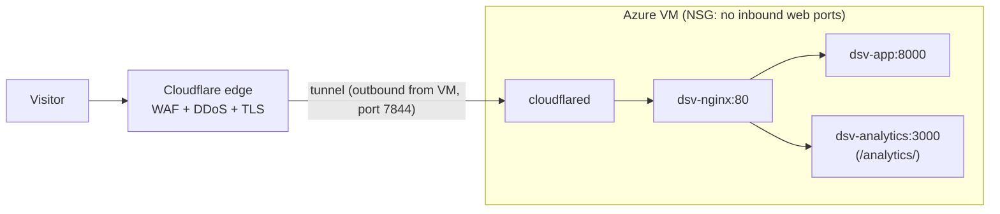

# Ingress: Cloudflare Tunnel in place of Application Gateway

This document explains how public traffic reaches DineSafeViz on the Azure VM
deployment, and why the design uses Cloudflare Tunnel instead of Azure
Application Gateway. It covers the Azure pattern the design mirrors, how the
tunnel works, how each environment uses it, and the trade-offs.

<!-- prettier-ignore -->
> [!NOTE]
> This describes the target state for the Azure VM deployment. It isn't built
> yet.

## Decision summary

The following table records the decision at a glance.

| Field     | Value                                                            |
| --------- | ---------------------------------------------------------------- |
| Date      | October 5, 2026                                                  |
| Status    | Accepted                                                         |
| Decision  | Publish the app through Cloudflare Tunnel, one tunnel per env    |
| Mirrors   | Azure VM baseline: Application Gateway + WAF in front of VMs     |
| Cost      | Free (Cloudflare Free plan, Zero Trust Free)                     |
| Rejected  | Application Gateway WAF_v2; inbound 443 with zone-level AOP      |

## The pattern Azure recommends

The
[Azure Virtual Machines baseline architecture](https://learn.microsoft.com/azure/architecture/virtual-machines/baseline)
places a managed layer 7 reverse proxy between the internet and the workload.
The design has four properties that matter here:

- **The workload VMs aren't exposed to the internet.** Each VM has only a
  private IP address. Users connect to the public IP of Application Gateway.
- **A web application firewall inspects requests.** The WAF, integrated with
  Application Gateway, applies managed rule sets based on the OWASP Core Rule
  Set before traffic reaches the backend.
- **TLS terminates at the proxy.** The gateway holds the public certificate,
  and it's stored in Key Vault.
- **NSGs restrict everything else.** Only the proxy can reach the backend
  ports.

Together these give a single, inspected front door, with no path to the
workload that bypasses it.

## Why not Application Gateway

Application Gateway delivers that pattern, but its cost doesn't fit a demo
project. According to
[Application Gateway pricing](https://learn.microsoft.com/azure/application-gateway/understanding-pricing#v2-skus),
the WAF_v2 SKU has a fixed cost of $0.443 per hour (East US example pricing).
That comes to about $323 USD per month before capacity units, even with no
traffic. The fixed cost applies whenever the gateway is provisioned, including
with autoscaling set to a minimum of zero instances.

DineSafeViz runs prod on a free-tier B2ats_v2 VM and has a $40 CAD monthly
budget per subscription. A gateway would cost about ten times the whole budget.

## How Cloudflare Tunnel mirrors the pattern

Cloudflare Tunnel gives the same front-door properties without an Azure
resource. The following table maps each Application Gateway role to its
equivalent in this design.

| Baseline component (Azure)              | DineSafeViz equivalent                                      |
| --------------------------------------- | ----------------------------------------------------------- |
| Application Gateway public IP, listener | Cloudflare edge, proxied DNS records for the hostnames      |
| WAF_v2 with OWASP managed rules         | Cloudflare WAF with the Free Managed Ruleset                |
| TLS certificate in Key Vault            | Cloudflare edge certificate, managed by Cloudflare          |
| Backend pool on private IPs             | `dsv-nginx` on the Docker network, reachable only by tunnel |
| NSG allowing only the gateway subnet    | NSG with no inbound web rules at all                        |
| DDoS protection on the public IP        | Cloudflare DDoS protection, included on the Free plan       |

The key point is the backend row. With Application Gateway, the backend is
private because it has no public IP. With Cloudflare Tunnel, the backend is
private because no inbound port is open to it. In both cases, the only way in
is through the inspected front door.

## How Cloudflare Tunnel works

Cloudflare Tunnel reverses the usual direction of the connection. The origin
connects out to Cloudflare, so Cloudflare never has to connect in. Per the
[Cloudflare Tunnel documentation](https://developers.cloudflare.com/cloudflare-one/networks/connectors/cloudflare-tunnel/),
the flow works like this:

1. You create a tunnel in the Cloudflare dashboard. A tunnel is a persistent
   object identified by a UUID, and Cloudflare issues a token for it.
2. You run the `cloudflared` connector on the origin with that token.
   `cloudflared` opens outbound connections to Cloudflare's network on port
   `7844`, using QUIC over UDP or HTTP/2 over TCP.
3. You add a published application route to the tunnel. The route maps a
   public hostname, such as `stg.dinesafeviz.com`, to a local service URL,
   such as `http://dsv-nginx:80`.
4. Cloudflare creates a proxied DNS record for that hostname that points at the
   tunnel, not at an IP address.
5. When a visitor requests the hostname, the Cloudflare edge applies WAF and
   DDoS rules, then sends the request down the already-open tunnel.
   `cloudflared` forwards it to the local service and returns the response the
   same way.

Because `cloudflared` initiates every connection, the firewall can block all
inbound traffic. Cloudflare's documentation describes exactly this: allow only
the outbound connections and block all inbound traffic, so nothing other than
Cloudflare can reach the origin.

## How DineSafeViz uses it

Each environment gets its own tunnel, token, and hostname, which keeps stg and
prod isolated in the same way their subscriptions and key vaults are.

The following table lists the per-environment values.

| Setting              | stg                          | prod                          |
| -------------------- | ---------------------------- | ----------------------------- |
| Subscription         | `dsv-stg01`                  | `dsv-prod01`                  |
| Tunnel name          | `tun-dsv-stg01`              | `tun-dsv-prod01`              |
| Published hostname   | `stg.dinesafeviz.com`        | `dinesafeviz.com`             |
| Service URL          | `http://dsv-nginx:80`        | `http://dsv-nginx:80`         |
| Token location       | `kv-dsv-stg01`               | `kv-dsv-prod01`               |
| Key Vault secret     | `dsv-tunnel-token`           | `dsv-tunnel-token`            |

The deployment uses the tunnel in these ways:

- **Compose service.** `cloudflared` runs as a container in the same Docker
  network as `dsv-nginx`, started with `tunnel --no-autoupdate run`. It reads
  the token from the `TUNNEL_TOKEN` environment variable instead of the
  `--token` flag, so the token doesn't appear in process listings. The image
  tag is pinned, so updates go through the normal deploy process.
- **Secret handling.** `fetch-secrets.sh` reads `dsv-tunnel-token` from the
  environment's key vault with the VM's user-assigned managed identity. It
  writes the token to `.env` with mode `600`, alongside the other secrets.
- **No origin certificate.** The tunnel carries traffic between the edge and
  the VM, so nginx keeps listening on plain HTTP port 80 inside the Docker
  network. The Cloudflare Origin CA certificate, and the `dsv-origin-cert` and
  `dsv-origin-key` secrets from the earlier plan, aren't needed.
- **No published host ports.** `dsv-nginx` and `dsv-analytics` don't publish
  ports on the VM. Only `cloudflared` can reach them.
- **NSG rules.** Inbound allows only SSH (port 22) from the operator's home IP.
  Outbound uses the default rules, which allow the tunnel's port `7844` and the
  VM's other egress, such as pulling images from GHCR and reaching Key Vault.
- **Client IP logging.** nginx sees `cloudflared` as the client. Cloudflare
  sends the visitor's address in the `CF-Connecting-IP` header, and the nginx
  log format records that header.

## Trade-offs

This design accepts the following trade-offs in exchange for zero cost and no
inbound exposure:

- **Vendor dependency.** Cloudflare is now in the request path for both DNS
  and traffic. If Cloudflare or the tunnel is down, the site is down, even if
  the VM is healthy.
- **No Azure-native WAF logs.** WAF events live in the Cloudflare dashboard,
  not in Log Analytics. Correlating them with VM logs is a manual step.
- **Single connector.** Each environment runs one `cloudflared` replica on one
  VM. That matches the single-VM design, but it isn't highly available.
  Cloudflare supports multiple connectors per tunnel if that changes later.
- **The VM keeps a public IP.** The VM still needs outbound internet access
  and an SSH path. The public IP exposes port 22 to the operator's home IP
  only, and no web ports.
- **Edge sees plaintext.** Cloudflare decrypts traffic at the edge to apply
  WAF rules. Application Gateway does the same, so this matches the baseline
  pattern rather than weakening it.

## Alternatives considered

The following options were evaluated and rejected.

| Option                                   | Why it was rejected                                                  |
| ---------------------------------------- | -------------------------------------------------------------------- |
| Application Gateway WAF_v2               | About $323 USD per month fixed cost, ten times the budget            |
| Inbound 443 + Cloudflare IP allowlist    | Cloudflare IPs are shared by all customers; another zone can reach it |
| The above + zone-level AOP (mTLS)        | Closes that gap, but adds two certificates, nginx mTLS, and IP upkeep |
| Expose nginx directly                    | No WAF, no DDoS protection, origin fully exposed                      |

Zone-level Authenticated Origin Pulls was the closest alternative. It's free
and secure when configured correctly. Note that Cloudflare's global AOP
certificate is shared across all Cloudflare accounts, so only zone-level or
per-hostname AOP stops another Cloudflare zone from reaching the origin. The
tunnel was chosen because it gets the same result with fewer moving parts:
there's no inbound port to protect in the first place.

## Next steps

When the workload moves to AKS, the same tunnel model can carry over:
`cloudflared` can run inside the cluster and route to an in-cluster service,
so the cluster doesn't need a public load balancer. Validate this during AKS
design.
