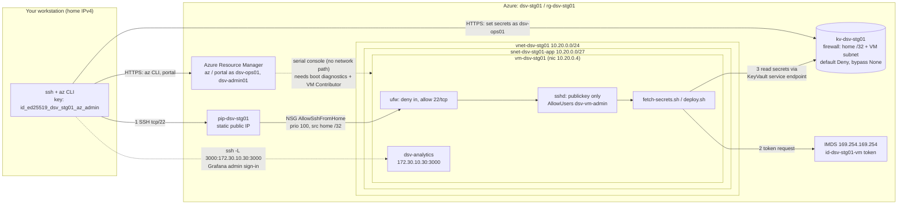
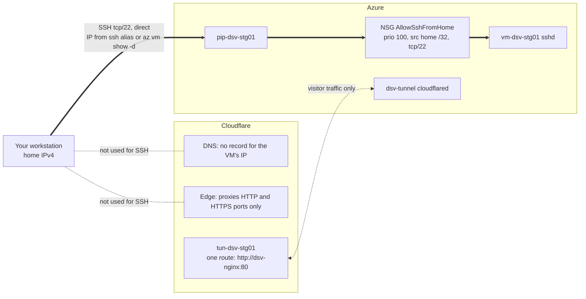
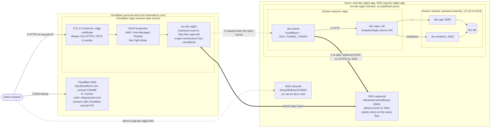
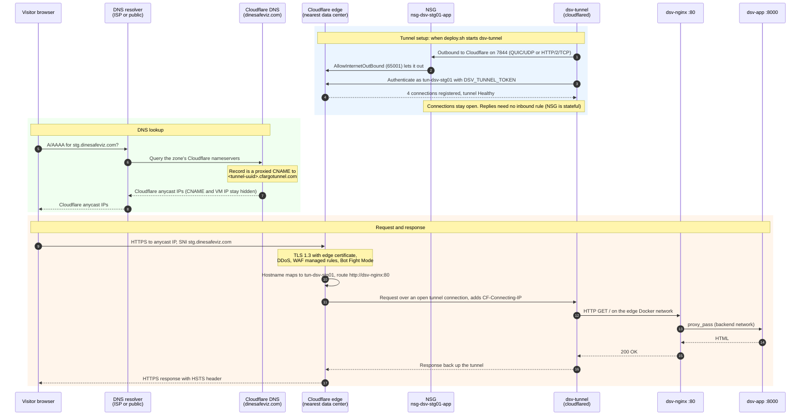

# Network paths: admin access and visitor traffic

This document shows the two ways traffic reaches a DineSafeViz Azure VM. The
first diagram is the admin path: how you SSH in and administer the VM. The
second shows that same path from Cloudflare's side. The third is the visitor path: how a request for `dinesafeviz.com` travels
through Cloudflare and the tunnel to the app, and which NSG rules apply along
the way. Names use stg; prod is the same with `prod01` and `10.10.0.0/24`.

For why the design uses Cloudflare Tunnel, see
[Ingress: Cloudflare Tunnel in place of Application Gateway](ingress-cloudflare-tunnel.md).

## Admin path

Admins take two separate routes into Azure. Azure Resource Manager and Key
Vault calls go over HTTPS with your Entra ID account. Shell access goes over
SSH to the VM's public IP, and only your home IP address can connect. The
serial console is the fallback when SSH is broken.

The admin path works like this:

1. **SSH to the VM.** You connect to `pip-dsv-stg01` on port 22. The subnet's
   NSG allows it only through `AllowSshFromHome`, priority 100, source your
   home IP `/32`. On the VM, ufw allows 22/tcp, and the `harden-vm.sh` sshd
   drop-in accepts public keys only and only for the admin user.
2. **Fetch secrets.** `fetch-secrets.sh` gets a token for `id-dsv-stg01-vm`
   from IMDS. A `DOCKER-USER` iptables rule drops IMDS traffic from
   containers, so only host processes can get this token.
3. **Read Key Vault.** The VM reaches `kv-dsv-stg01` through the subnet's
   `Microsoft.KeyVault` service endpoint, which the vault firewall allows.
   Your workstation reaches the same vault through the vault's home IP rule.
4. **Reach Grafana as admin.** `/analytics/login` returns `404` on the public
   site, so you sign in through an SSH local forward to Grafana's fixed
   address on the internal Docker network.
5. **Fall back to the serial console.** It connects through the VM's virtual
   serial port, so NSG, ufw, and sshd mistakes don't block it. It needs a
   local password and a role with Virtual Machine Contributor actions.

If your home IP address changes, both the NSG rule and the vault firewall
block you. See
[Troubleshoot: your home IP address changed](../../how-to/azure-vm/troubleshoot-home-ip-change.md).

## The admin path from Cloudflare's side

Cloudflare isn't part of the admin path. Your SSH connection goes from your
home IP address straight to the VM's Azure public IP. It doesn't use
Cloudflare DNS, the edge, or the tunnel, so Cloudflare never sees it, and the
WAF, DDoS protection, and Bot Fight Mode don't protect it. The NSG's source
`/32` rule is the only network control on port 22.

You get the VM's address from your SSH alias for `vm-dsv-stg01` or from
`az vm show -d --query publicIps`, not from a `dinesafeviz.com` record. That
matters for two reasons:

- **A proxied record wouldn't carry SSH.** Cloudflare's proxy only handles a
  fixed list of HTTP and HTTPS ports, such as 80 and 443. For port 22,
  Cloudflare's docs say to use a DNS-only (gray-cloud) record, which connects
  straight to the origin, or Spectrum, which needs the Enterprise plan for
  SSH. See
  [Network ports](https://developers.cloudflare.com/fundamentals/reference/network-ports/).
- **A DNS-only record would publish the origin IP.** Anyone could look up the
  VM's public IP and send traffic to it, bypassing the edge. The NSG still
  blocks them, but the visitor path no longer hides the VM's address.
  Leaving the VM out of Cloudflare DNS avoids that.

Cloudflare does offer SSH through a tunnel. `cloudflared access ssh` on your
workstation connects to a hostname that's protected by a Cloudflare Access
policy, and the tunnel carries the session to the server. With it, you could
remove `AllowSshFromHome` and leave the NSG with no inbound allow rules at
all. DineSafeViz doesn't use it. The current
`dsv-tunnel` runs in a Docker network with one HTTP route, so it can't reach
the host's sshd without more setup. See
[Connect to SSH with client-side cloudflared](https://developers.cloudflare.com/cloudflare-one/networks/connectors/cloudflare-tunnel/use-cases/ssh/ssh-cloudflared-authentication/).

## Visitor path

Visitors never connect to the VM. They connect to Cloudflare, and Cloudflare
sends the request down a tunnel that `cloudflared` on the VM opened outbound.
Because of that, the NSG has no inbound rule for ports 80 or 443. The first
diagram shows where each piece sits. The sequence diagram after it shows the
order things happen in.

### Step by step

The sequence diagram follows one visit to `https://stg.dinesafeviz.com/`,
starting from when the tunnel comes up during a deploy.

The three phases work like this:

- **Tunnel setup (steps 1 to 4).** When `deploy.sh` starts `dsv-tunnel`,
  `cloudflared` reads `DSV_TUNNEL_TOKEN` from `.env` and connects out to
  Cloudflare on port 7844, using QUIC over UDP or HTTP/2 over TCP. The NSG's
  default `AllowInternetOutBound` rule allows it. The token identifies the
  connector as `tun-dsv-stg01`. A healthy tunnel holds four connections to
  Cloudflare and keeps them open, so Cloudflare can send requests back down
  them without ever connecting in. NSGs are stateful, so that return traffic
  needs no inbound rule.
- **DNS lookup (steps 5 to 8).** The tunnel's published-application route
  created `stg.dinesafeviz.com` as a proxied CNAME to
  `<tunnel-uuid>.cfargotunnel.com`. Because it's proxied, Cloudflare DNS
  answers with Cloudflare anycast IP addresses, not the CNAME target and not
  the VM's public IP. A `cfargotunnel.com` name only serves DNS records in
  the same Cloudflare account, so someone who learns the tunnel UUID can't
  point their own domain at it.
- **Request and response (steps 9 to 17).** The browser connects to the
  nearest Cloudflare data center. The edge terminates TLS with its edge
  certificate, enforces TLS 1.3 minimum, and applies DDoS protection, the
  Free Managed Ruleset, and Bot Fight Mode. It then matches the hostname to
  the tunnel's route and sends the request down one of the open connections.
  `cloudflared` forwards it as plain HTTP to `dsv-nginx` on the `edge` Docker
  network, and nginx proxies `/` to `dsv-app` and `/analytics/` to Grafana on
  the `internal` `backend` network. The response returns the same way. nginx
  logs the visitor's address from the `CF-Connecting-IP` header, because the
  connection itself comes from `cloudflared`.

If `dsv-tunnel` isn't running, as when the stg VM is deleted, DNS still
resolves to Cloudflare, but the edge has no open connection to send the
request to, so visitors get a Cloudflare error page.

The following table lists what controls each part of the visitor path.

| Control | Where | Effect on visitor traffic |
| --- | --- | --- |
| Proxied CNAME | Cloudflare DNS | Hides the VM's IP; visitors resolve to Cloudflare |
| Minimum TLS 1.3, Always Use HTTPS, HSTS | Cloudflare zone | Rejects older TLS and upgrades HTTP to HTTPS |
| DDoS protection, Free Managed Ruleset, Bot Fight Mode | Cloudflare edge | Blocks attacks before they reach the tunnel |
| Tunnel route `http://dsv-nginx:80` | `tun-dsv-stg01` | The only backend Cloudflare can reach |
| `DenyAllInBound` (65500) | NSG, inbound | Drops direct connections to the public IP on any port except 22 from home |
| `AllowInternetOutBound` (65001) | NSG, outbound | Lets `cloudflared` open the tunnel on 7844 |
| `ports: !reset []` | `docker-compose.vm.yml` | No container listens on the host, so ufw and Docker port rules never matter for web traffic |
| `/analytics/login` returns `404` | `vm-public.conf` | Grafana sign-in isn't reachable from the internet |

## Next steps

- Set up or change these controls with the
  [Azure checklist](../../how-to/azure-vm/azure-checklist.md), parts 2 and 5.
- Deploy through the tunnel as described in [CI and CD](ci-cd.md).
