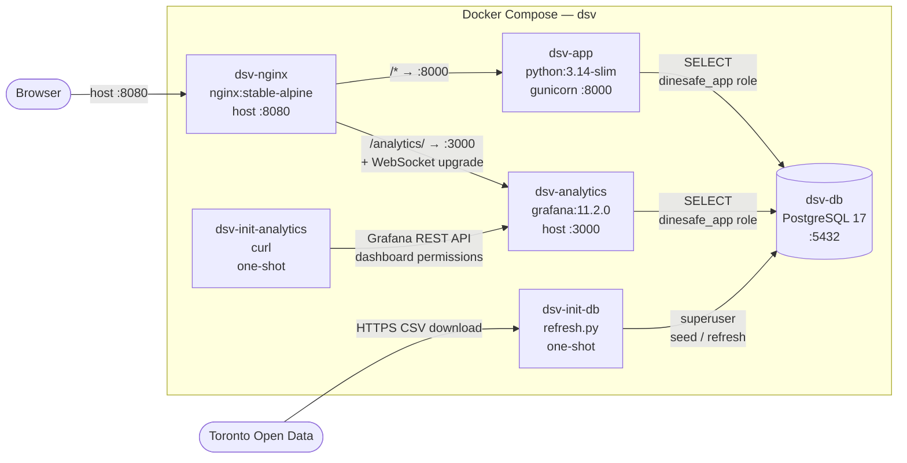

# Application architecture

This document describes the application architecture of DineSafeViz, which is a [3-tier web application](https://learn.microsoft.com/en-us/azure/architecture/guide/architecture-styles/n-tier). 

**Tier 1 — Presentation / edge**
dsv-nginx is the primary entry point, listening on host port 8080, and routes
traffic to either the Flask UI or the Grafana UI. Grafana's web UI is also a
presentation-layer consumer. Note: `dsv-analytics` also binds host port 3000
directly (see [Services](#long-running-services)), which bypasses nginx.

**Tier 2 — Application / business logic**
dsv-app — the Flask app under gunicorn. Renders templates, handles /healthz, /readyz, /metrics, queries the DB, applies the 5-day in-memory cache for home stats.

**Tier 3 — Data**
dsv-db (PostgreSQL 17) is the single source of truth. Both dsv-app and dsv-analytics (Grafana) read from it via the SELECT-only dinesafe_app role.

The two one-shot containers (dsv-init-db, dsv-init-analytics) are bootstrap/migration tooling, not their own tier — they exist to bring the data tier and the Grafana tenant into a known state at start.


It covers the Docker Compose services, the Flask web app, the analytics
dashboard, and how they fit together. For data-layer details see
[data architecture](arch-data.md). For infrastructure and deployment
see [IaC architecture](arch-iac.md).

DineSafeViz runs as a Docker Compose stack on a single VM. The stack
contains six primary services (three long-running, two one-shot, one
reverse proxy).


The following diagram shows runtime interactions between services — traffic
flows, database roles, and one-shot bootstrap dependencies.



## Services

### Long-running services

- **`dsv-nginx`** — `nginx:stable-alpine`. Listens on host port 8080 (internal
  port 80). Routes `/analytics/` to `dsv-analytics:3000` (with WebSocket
  upgrade headers for Grafana Live) and all other requests to `dsv-app:8000`.
  Blocks `/metrics` externally (returns 404). Starts only after `dsv-app`
  passes its healthcheck.

- **`dsv-app`** — `python:3.14-slim-bookworm` (multi-stage build).
  Runs the Flask app under gunicorn (gthread worker, 1 worker, 4
  threads) on port 8000. Internal-only — not exposed on the host.
  Runs as `nonroot` (UID/GID 65532). Connects to `dsv-db` using the
  `dinesafe_app` role (SELECT-only). Exposes `/healthz` and `/readyz`
  for health gating. Starts after `dsv-db` is healthy.

- **`dsv-analytics`** — `grafana/grafana:11.2.0`. Serves a pre-provisioned
  Grafana dashboard on port 3000. Port 3000 is bound on the host directly
  (in addition to being reverse-proxied via nginx at `/analytics/`). Uses
  `dsv-db` as its PostgreSQL data source via the `dinesafe_app` role.
  Dashboard state persists in a named volume (`dsv-analytics-data`).
  Anonymous viewer access is enabled.

### One-shot services

- **`dsv-init-db`** — Runs `refresh.py` on startup. Seeds the database
  on first run (historical 2001–2022 + recent CSV); refreshes recent data on
  subsequent runs. Exits after completion (`restart: "no"`). Connects using
  the superuser credentials (`DSV_DB_USER`), which has full DDL and write
  access — distinct from the read-only `dinesafe_app` role used by the app
  and analytics, and the `dinesafe_migrator` role defined in `init.sql` for
  future schema migration use. See [data architecture — data
  ingestion](arch-data.md#data-ingestion) for details.

- **`dsv-init-analytics`** — `curlimages/curl:latest`. Waits for
  Grafana to become healthy, then grants Viewer-role access to the
  provisioned dashboard via the Grafana API. Required because Grafana
  11 RBAC doesn't grant anonymous viewers dashboard access by default.

## Web app

The Flask app at `src/dsv-app/app.py` serves four pages and three
operational endpoints.

| Route | Description |
|---|---|
| `GET /` | Home page with summary statistics (total inspections, years of data) |
| `GET /inspections` | Inspection log, filterable by year and quarter |
| `GET /dashboard` | Embeds the Grafana dashboard via iframe |
| `GET /info` | Background on the DineSafe dataset |
| `GET /healthz` | Liveness probe — always returns `200 ok` |
| `GET /readyz` | Readiness probe — returns `200 ok` or `503 db unreachable` based on a `SELECT 1` against `dsv-db` |
| `GET /metrics` | Prometheus metrics (via `prometheus-flask-exporter`) |

The analytics reverse proxy previously handled at `/analytics/<path>`
has been removed from the Flask app. nginx handles that routing
directly.

### Inspection browsing

Inspections are grouped by date and sorted by establishment status within each
day (Closed > Conditional Pass > Pass; unknown statuses sort last). Year and
quarter navigation covers 2001 to the present. The navigation uses a dropdown
with flyout menus — the four most recent years are shown directly, older years
are nested under an "Archive" section. Note: 2023 navigation only shows Q4,
because the recent CSV starts from Q4 2023 and historical data ends in 2022.

### Home page caching

The home page queries aggregate stats (total inspections and years of
data) from the database and caches the result in memory with a 5-day
TTL to avoid repeated queries on a dataset that changes infrequently.

### Observability

The app emits structured JSON logs via `python-json-logger`. Every
request is logged at INFO level with `request_id` (UUIDv4),
`route`, `method`, `status`, `duration_ms`, and `remote_addr`. The
same `request_id` is echoed back in the `X-Request-ID` response
header.

Prometheus metrics are exposed at `/metrics` via `prometheus-flask-exporter`.
nginx blocks this endpoint externally (returns 404), so scraping must happen
from within the Docker network. Four custom metrics are defined:

| Metric | Type | Description |
|---|---|---|
| `dsv_db_query_duration_seconds` | Histogram | DB query latency, labeled by `route` |
| `dsv_stats_cache_hits_total` | Counter | Home stats cache hits |
| `dsv_stats_cache_misses_total` | Counter | Home stats cache misses |
| `dsv_inspection_query_rows` | Histogram | Rows returned per `/inspections` request |

OpenTelemetry SDK traces are emitted to the console via
`ConsoleSpanExporter` (local dev only). `FlaskInstrumentor` and
`Psycopg2Instrumentor` are active. The service name defaults to
`unknown_service` until `OTEL_SERVICE_NAME` is configured.

## Analytics dashboard

The Grafana dashboard ("DineSafe Inspections Metrics") reads directly
from the PostgreSQL database and renders visualizations. It's
provisioned from files at startup — no manual Grafana UI setup is
needed.

Dashboard panels are organized into sections:

- **Inspection overview:** total inspections, pass/conditional
  pass/closed counts and percentages
- **Trends:** inspections over time, inspections by day of week
- **Enforcement:** enforcement and remediation breakdowns
- **Severity breakdown:** dedicated sections for crucial, significant,
  and minor infractions, each with panels for breakdowns by
  establishment type, enforcement action type, infraction details,
  and inspection observations

## Data model

One table: `inspections` (19 columns). See
[data architecture](arch-data.md) for the full schema, data sources,
and ingestion logic.

## File layout

```text
DineSafeViz/
├── docker-compose.yml
└── src/
    ├── dsv-db/
    │   ├── Dockerfile
    │   ├── init.sql              (creates roles + table; run once by postgres on first start)
    │   ├── refresh.py            (data seeding and daily refresh)
    │   ├── requirements.txt
    │   └── tests/
    │       └── test_refresh.py
    ├── dsv-analytics/
    │   └── provisioning/
    │       ├── dashboards/       (dashboard.yml, dinesafe.json)
    │       └── datasources/      (datasource.yml)
    ├── dsv-app/
    │   ├── Dockerfile            (multi-stage; nonroot UID 65532)
    │   ├── gunicorn.conf.py      (1 worker + 4 gthreads for local; see file for prod notes)
    │   ├── app.py
    │   ├── requirements.txt
    │   ├── requirements-dev.txt
    │   ├── VERSION.txt
    │   ├── static/
    │   │   ├── style.css
    │   │   ├── favicon/
    │   │   └── fonts/            (IBM Plex Sans .woff2)
    │   ├── templates/
    │   │   ├── base.html
    │   │   ├── home.html
    │   │   ├── index.html
    │   │   ├── dashboard.html
    │   │   └── info.html
    │   └── tests/
    │       ├── conftest.py
    │       ├── test_helpers.py
    │       ├── test_home.py
    │       ├── test_routes.py
    │       ├── test_health.py
    │       └── test_dashboard.py
    └── dsv-nginx/
        └── nginx.conf            (routes /analytics/ → Grafana, /* → dsv-app)
```

## Configuration

All services are configured via environment variables, typically set
in a `.env` file on the deployment target. The `.env` is templated
from Ansible Vault at deploy time — see
[security architecture](arch-security.md) for secrets management.

| Variable | Used by | Default | Description |
|---|---|---|---|
| `DSV_DB_HOST` | app, init-db, analytics | `dsv-db` | Postgres hostname |
| `DSV_DB_PORT` | app, init-db, analytics | `5432` | Postgres port |
| `DSV_DB_NAME` | app, init-db, analytics | `dinesafe` | Database name |
| `DSV_DB_USER` | init-db, dsv-db | — | Superuser (DDL, data ingestion) |
| `DSV_DB_PASSWORD` | init-db, dsv-db | — | Superuser password |
| `DSV_DB_APP_USER` | app, analytics | `dinesafe_app` | App role (SELECT only) |
| `DSV_DB_APP_PASSWORD` | app, analytics | `dinesafe_app` | App role password |
| `DSV_ANALYTICS_ROOT_URL` | analytics | `http://localhost:8080/analytics/` | Public-facing Grafana root URL |
| `DSV_ANALYTICS_ADMIN_USER` | analytics, init-analytics | — | Grafana admin username |
| `DSV_ANALYTICS_ADMIN_PASSWORD` | analytics, init-analytics | — | Grafana admin password |

## Related documents

- [Data architecture](arch-data.md) — data sources, schema, ingestion,
  and refresh logic
- [IaC architecture](arch-iac.md) — image pipeline, VM provisioning,
  and app deployment
- [Security architecture](arch-security.md) — secrets management, VM
  hardening, container security
- [Testing architecture](arch-testing.md) — unit tests, functional
  tests, and gaps
- [CI/CD architecture](arch-ci-cd.md) — release automation and
  dependency management
- [Monitoring architecture](arch-monitoring.md) — planned observability
  stack
